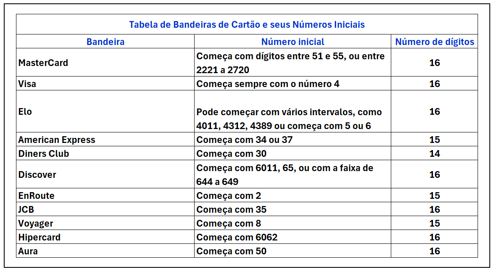

# GitHub Copilot como Assistente de Codificação

Este projeto tem como objetivo desenvolver uma aplicação simples capaz de identificar a bandeira de um cartão de crédito (como Visa, MasterCard, etc.) com base no número do cartão. Utilizando o **GitHub Copilot** como assistente de codificação, exploramos como a inteligência artificial pode acelerar o desenvolvimento, sugerir trechos de código e melhorar a produtividade.

## Descrição do Projeto

Inicialmente, forneci ao Copilot um arquivo `.csv` com os padrões numéricos que identificam cada bandeira e criei a pasta `src` e, dentro dela, o arquivo `index.js` (JavaScript).

### Padrões fornecidos:

Ativei o chat do Copilot e inseri o seguinte prompt:

> **Prompt:**  
> `Create in Javascript a function to validate credit card number based on the .csv attached to identify the field 'Bandeira'`

O Copilot gerou o código prontamente.

Solicitei ao chat do Copilot uma única modificação no código: permitir que o número do cartão fosse inserido via input em tempo de execução, e não no código, como apresentado na aula do **Felipão da DIO**.

---

Outra melhoria importante foi especificar melhor os dados de entrada. Na aula do Felipão não era levado em conta o número de dígitos de cada bandeira, e o código gerado para a função Regex foi assim:

Como os cartões **American Express** e **Diners Club** possuem 15 e 14 dígitos respectivamente, e não os usuais 16, o código foi ajustado para:

---

Porém, a Regex apenas garante que o número está formatado corretamente, mas não que é um número real de cartão. Para validar matematicamente se o número de cartão é plausível, é necessário realizar um outro check: o **Luhn Check**.

Para isso, criei um outro arquivo `luhn.js` com a função `luhnCheck(numeroCartao)`:

O `index.js` chama essa função. Assim, utilizando ambos — **Regex** e **Luhn Algorithm** —, é possível reduzir erros e fraudes em aplicações.

---

## Recursos Utilizados

- [Gerador de número de cartão de crédito](https://www.4devs.com.br/gerador_de_numero_cartao_credito)

## Conhecimento Adquirido

### 📌 RegEx  
[regexr.com](https://regexr.com)

Uma ferramenta poderosa que funciona como uma lupa superpotente para encontrar e manipular pedaços de texto em meio a grandes volumes de informação.

**RegEx**, ou **Expressão Regular**, é uma sequência de caracteres especiais que define um padrão de busca. Em vez de procurar por um texto exato (`"olá mundo"`), você descreve um formato para buscar (`"uma palavra que começa com 'o', seguida de qualquer número de letras, e termina com 'o'"`).

Pense como se você estivesse dando instruções para um detetive textual:

- "Procure por qualquer palavra que comece com a letra 'A'."
- "Encontre todas as sequências de números com exatamente 5 dígitos."
- "Localize todas as linhas que contenham a palavra 'erro', mas ignore a capitalização."

No código, o **RegEx** foi usado para identificar os padrões dos números dos cartões de crédito. Sem esse recurso, seria necessário usar uma série de estruturas `if-then-else`, tornando o código mais extenso e menos eficiente.

---

### 📌 Luhn Algorithm  
[geeksforgeeks.org/luhn-algorithm](https://www.geeksforgeeks.org/luhn-algorithm/)

O **Luhn Algorithm** é um método simples de verificação usado para validar números de identificação, como cartões de crédito. Foi criado por **Hans Peter Luhn**, da IBM, em 1954.

O algoritmo funciona realizando operações matemáticas sobre os dígitos do número para gerar um valor de controle. Se o resultado final for divisível por 10, o número é considerado válido.

> 📌 Importante: Ele foi concebido para proteger contra erros de digitação e não contra ataques maliciosos.

---

## 📂 Estrutura de Pastas

---

## 📋 Conclusão

Esse projeto demonstrou como o **GitHub Copilot** pode ser um assistente poderoso para acelerar o desenvolvimento, sugerir melhorias e ensinar boas práticas. Além disso, aprofundou o uso de **Regex** e **Luhn Algorithm** para validação de dados sensíveis.

